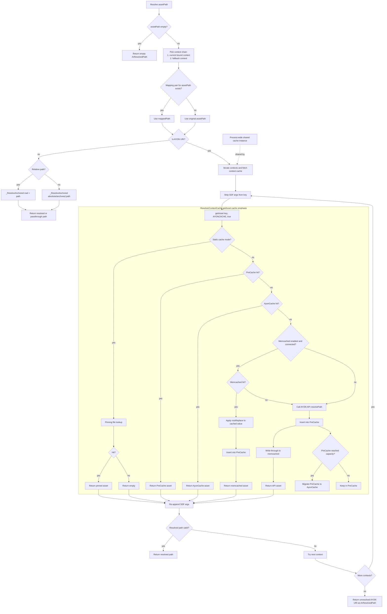

# Asset Resolution Flow with Caching

## Mermaid2 Diagram

## Summary

- Resolution begins by evaluating the current context, then fallback context, and applying any mapping pair substitution before path-type logic.
- Non-AYON paths bypass AYON cache logic and resolve through anchored filesystem resolution.
- AYON paths use a cache-first strategy in this order: PreCache, AyonCache, memcached, then AYON REST API.
- Memcached acts as a distributed second-level cache:
  - On hit, values are root-replaced and promoted into local PreCache.
  - On miss, the resolver calls AYON API and writes through to memcached.
- Local hot data is kept in PreCache; when full, entries are migrated into AyonCache for longer-lived in-process reuse.
- In static cache mode, dynamic resolution is bypassed and pinning-file data is returned directly.
- A process-wide shared ResolverContextCache instance is used by contexts, which improves reuse across resolutions in the same process.
